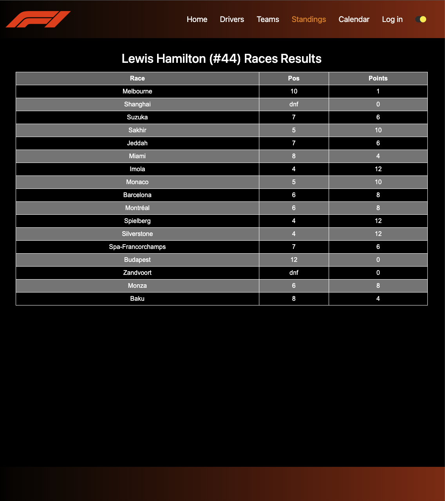
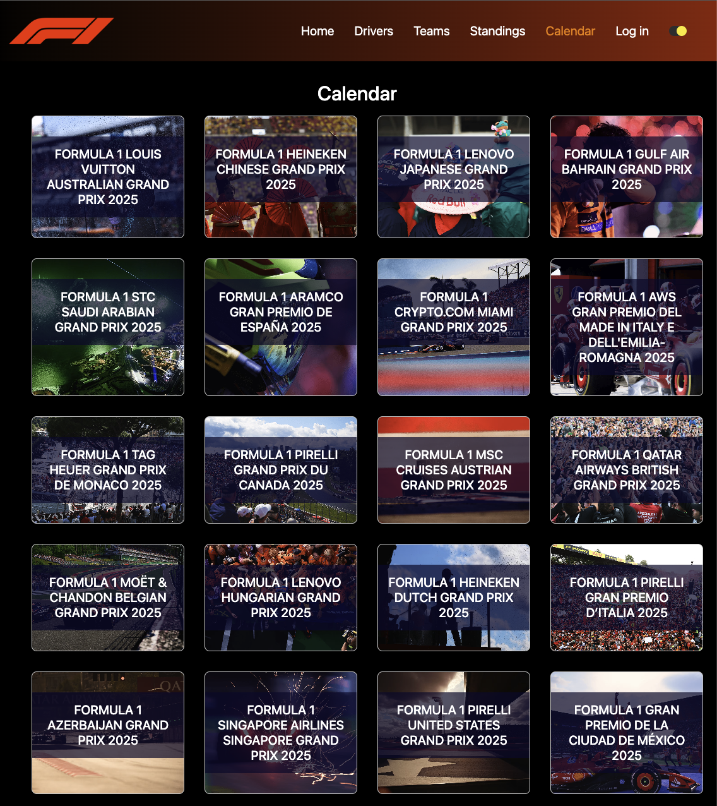

# f1-dashboard

## Overview

f1-dashboard is an interactive Formula One dashboard web application that aggregates race data, standings, driver and team stats, and community discussion in a single, user-friendly platform. The dashboard allows F1 fans to follow their favorite drivers and teams, track race results, view upcoming events, and participate in a dedicated forum.

## Problem Statement

Formula One fans often have to visit multiple sources to get up-to-date information on races, standings, and driver stats. There is a need for a unified platform that not only aggregates this data but also provides a personalized and interactive experience, including community features and user customization.

## Project Goals

- Centralize all essential F1 data (calendar, results, standings, drivers, teams) in one dashboard
- Enable users to personalize their experience by selecting favorite drivers and teams
- Foster community engagement through an integrated discussion forum
- Provide a modern, responsive, and visually appealing UI
- Support both light and dark themes for accessibility

## Screenshots

<!-- Add screenshots here -->





<!-- Add more screenshots as needed -->

## Core Features

- User authentication and registration
- Create and manage favorite drivers and teams
- View previous race results and detailed statistics
- Browse all drivers and teams with detailed profiles
- Display up-to-date championship standings and points
- Interactive race calendar with event details
- Countdown timer for the next Grand Prix
- Integrated F1 discussion forum for community interaction
- Responsive design with dark/light mode support

## Stretch Goals

- Live race dashboard with real-time updates
- Past race dashboard with analytics
- Enhanced user profile customization

## Tech Stack

**Frontend:**

- React (Vite)
- Context API for state management
- CSS Modules for component-level styling
- Vite for fast development and build

**Backend:**

- Node.js
- Express.js
- PostgreSQL (with SQL schema and queries)
- JWT for authentication
- bcrypt for password hashing

**Other Tools:**

- ESLint for code linting
- Vitest for testing

## Architecture Overview

### Folder Structure

```
f1-dashboard/
├── backend/
│   ├── api/                # Express route handlers for REST API
│   ├── db/                 # Database client, schema, seed, and queries
│   │   ├── data/           # Static data (country codes, race calendar, etc)
│   │   ├── queries/        # SQL query modules for each resource
│   ├── middleware/         # Express middleware (auth, error handling)
│   ├── utils/              # Utility functions (JWT, etc)
│   ├── app.js              # Express app setup
│   ├── server.js           # Server entry point
│   ├── package.json        # Backend dependencies
│   └── ...
├── frontend/
│   ├── public/             # Static assets (images, redirects)
│   ├── src/
│   │   ├── api/            # API hooks and context
│   │   ├── auth/           # Authentication components and context
│   │   ├── components/     # Main UI components (calendar, drivers, forum, layout, profile, standings, teams)
│   │   ├── styles/         # CSS modules for styling
│   │   ├── App.jsx         # Main app component
│   │   ├── main.jsx        # Entry point
│   │   └── ...
│   ├── index.html          # HTML template
│   ├── package.json        # Frontend dependencies
│   └── ...
├── README.md
└── ...
```

### System Design

- **Frontend** communicates with the **backend REST API** for all data (drivers, teams, calendar, forum, user auth, etc).
- **Backend** uses Express.js to serve API endpoints and interacts with a PostgreSQL database for persistent storage.
- **Database** stores users, drivers, teams, race results, forum posts, and favorites.
- **Authentication** is handled via JWT tokens, with secure password hashing using bcrypt.
- **Forum** and user favorites are fully integrated, allowing for a personalized and social experience.

## Getting Started

1. Clone the repository
2. Install dependencies for both frontend and backend
3. Set up the PostgreSQL database using the provided schema and seed files
4. Start the backend server
5. Start the frontend development server

## Contributing

Pull requests are welcome! For major changes, please open an issue first to discuss what you would like to change.

## License

MIT
